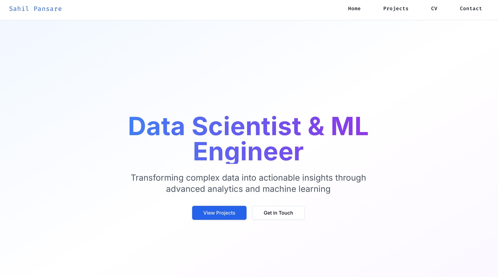

# AI/ML Portfolio Website

A sleek, modern portfolio website built with React, Tailwind CSS, and Material-UI. This project showcases my skills and projects in the field of Machine Learning and Artificial Intelligence.

## Features

- Responsive design works on all devices
- Dark mode with a clean, modern UI
- Sections for Projects, CV/Resume, and Contact
- Python Flask backend for handling form submissions and serving the React app
- Optimized for GitHub Pages deployment

## Demo

You can visit the live demo [here](https://sahilkp1691.github.io/portfolio).

## Tech Stack

### Frontend
- React.js
- Tailwind CSS
- Material-UI
- React Router (for navigation)

### Backend
- Python
- Flask

## Acknowledgments

- [React](https://reactjs.org/)
- [Material-UI](https://mui.com/)
- [Tailwind CSS](https://tailwindcss.com/)
- [Flask](https://flask.palletsprojects.com/)
